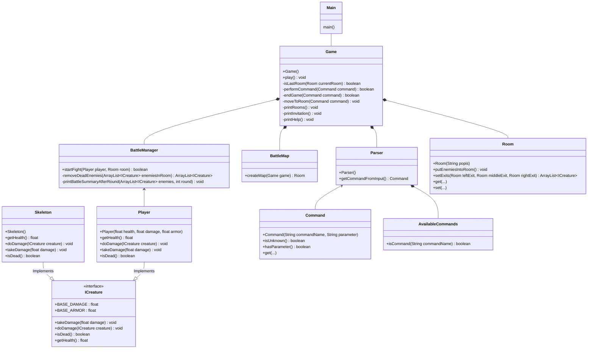

# WoF_BattleEdition
 World of Fri - Battle edition is a game, where you have to fight through dark rooms of building to reach end boss restraining you from leaving alive. 

 ***Hint: Game is in "main" branch, donwload zip or clone repository in top right corner***
 ## Ideas
 Some ideas which we will add as we develop our game.
 ### NPC
 - Merchants
 - Buffs
 - ??
 ### Items
 - Passive items
 - Usable items
 ### Enemies
 - Special type
 - Random chance of spawning
 - ??
# UML - Class

